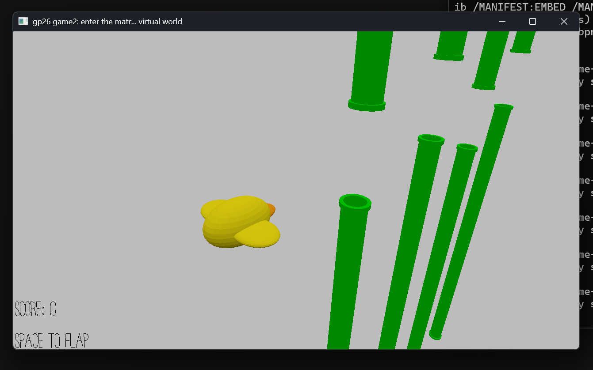

# Flappy Bird 9000

Author: Jerry Wang (jerrywa2)

Design: This is flappy bird but reimagined with 3D graphics, accelerating speed, and moving pipes! Every pipe after the first three are randomly generated.

Screen Shot:

How To Play:

Press SPACEBAR to flap your wings, and don't get hit by the pipes.

This game was built with [NEST](NEST.md).
